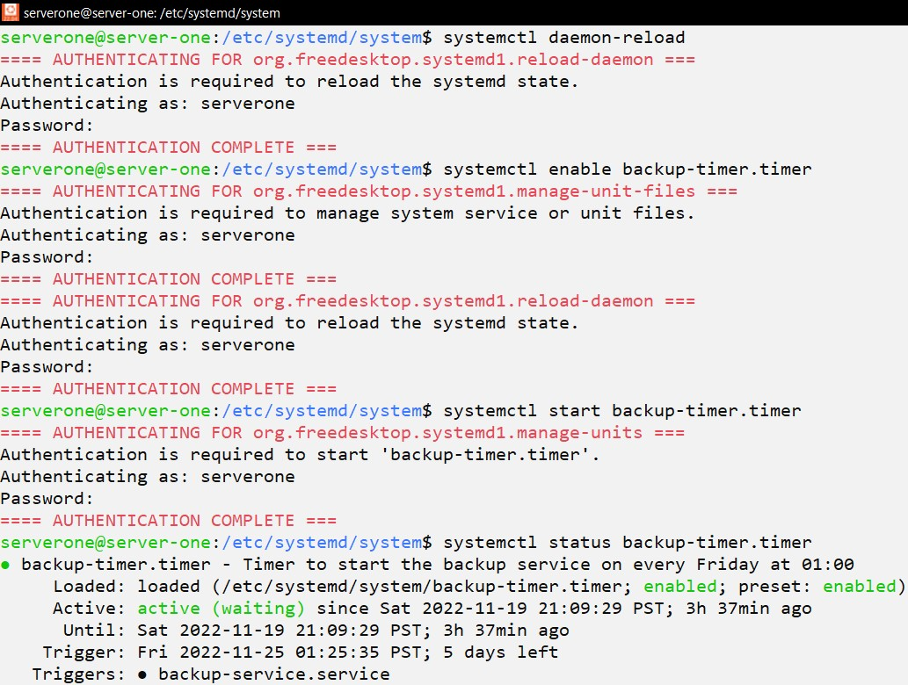

# ACIT 2420 - Week 11 Lab 

## Team Members: 
* **Amanda Chang**
* **Jose Bangate** 

---

## Steps to Create a Remote Server in DigitalOcean 
1. In **wsl**, Use `ssh-keygen -t ed25519 -C "OPTIONAL_COMMENT"` to generate a public/private key pair. Save it to a new file in the **.ssh** folder. 

2. Add a new SSH key in **DigitalOcean**: <br/>
**Settings** -> **Security** -> **Add SSH Key** <br/>
-> Copy and paste the public key from the .pub file in the .ssh folder into **SSH key content** box <br/>
-> input a SSH key name into **Name** box -> Click **Add SSH Key**  

3. Create a new remote server in **DigitalOcean**: <br/>
Select an existing project OR Create a **New Project** <br/>
-> Click **Create** <br/>
-> Click **Droplets** <br/>

4. Create a regular user account in **wsl**: <br/>
-> `ssh -i ~/.ssh/KEYFILE_NAME root@DIGITALOCEAN_IP_ADDRESS` <br/>
-> `useradd -ms /bin/bash USER_NAME` <br/>
-> `usermod -aG sudo USER_NAME` <br/>
-> `passwd USER_NAME` <br/>
-> `rsync --archive --chown=USER_NAME:USER_NAME ~/.ssh /home/USER_NAME` 


5. Login as regular user: </br>
`ssh -i ~/.ssh/FILE_NAME USER_NAME@DIGITALOCEAN_IP_ADDRESS` <br/>
-> `sudo vi /etc/ssh/sshd_config` <br/>
-> `sudo systemctl restart ssh` <br/>
-> `sudo apt update && sudo apt upgrade`

### For Backup Section 
6. As the server-one user, repeat step 1 to 4 for backup-server.<br/>
After a public/private key pair is created for the backup-server, <br/>
use `cat KEY_FILE_NAME.pub >> authorized_keys` to append the public key to authorized_keys file in **.ssh**.

---

##  Backup 

### Created 2 new servers on DigitalOcean 
* server-one 
* backup-server 

### Step 1: Development Environment (wsl) - Write Scripts and Unit Files 
* backup-script 
* backup.conf 
* backup-service.service 
* backup-timer.timer 

#### backup.conf 
The *backup.conf* configuration file includes two variables: 
- a directory to be backup 
- an IP address of the backup-server 

```Shell
# Create a configuration file with the following content: 
backupDir=<Path of the Directory to be Backup>
ip=<IP Address of the Backup Server>
```

#### backup-script 
The *backup-script* `source` the *backup.conf* configuration file and uses `rsync` command to backup a specified directory from server-one to the backup-server on every Friday at 01:00. 
- The `-e` option contains the absolute path of the (backup-server's) private key file in server-one's .ssh folder 

**Example**
<!--  -->
```Shell
#!/bin/bash

source /opt/backup/backup.conf
rsync -avr ${backupDir} backupserver@${ip}:/home/backupserver/BackupDir -e "ssh -i /home/serverone/.ssh/backup_key -o StrictHostKeyChecking=no"
```

#### Unit File: backup-service.service 
The *backup-service.service* unit file specifies location of the *backup-script* and execute the script to backup files from server-one to the backup-server.  

**Example**
<!--  -->
```Shell
[Unit]
Description=Backup files from server-one to the backup-server using rsync 

[Service]
Type=oneshot
ExecStart=/opt/backup/backup-script

[Install]
WantedBy=multi-user.target
```

#### Unit File: backup-timer.timer 
The *backup-timer.timer* unit file sets backup service to start on every Friday at 01:00. 

**Example**
<!--  -->
```Shell
[Unit]
Description=Timer to start the backup service on every Friday at 01:00  

[Timer]
OnCalendar=Fri *-*-* 01:00:00
RandomizedDelaySec=10000
Persistent=true
Unit=backup-service.service

[Install]
WantedBy=timers.target
```

### Step 2: Use `sftp` to Transfer Files to Remote Server  
1. In **wsl**, run `sftp -i .ssh/KEY_FILE_NAME USER_NAME@DIGITALOCEAN_IP_ADDRESS` command. 
2. Use `put -r FOLDER_NAME` to transfer all the files in a directory or `put FILE_NAME` to transfer a file. 

**Example**


### Step 3: Switch to Ubuntu (Server)
* Log in server-one by `ssh -i ~/.ssh/KEY_FILE_NAME USER_NAME@DIGITALOCEAN_IP_ADDRESS`.

### Step 4: Set the Time Zone in Ubuntu 
* `timedatectl status` displays the current time zone 
* `timedatectl list-timezones` displays a list of available time zones 
* `sudo timedatectl set-timezone America/Vancouver` sets the time zone to America/Vancouver 

**Example**


### Step 5. Locations to Store Script and Unit Files 

#### Script 
1. Create a new directory in **/opt** by `sudo mkdir /opt/NEW_DIR`.
2. Save the *backup-script* to the **/opt/NEW_DIR** by `sudo mv backup-script /opt/NEW_DIR`.
3. Depends on where you specified your backup.conf will be in *backup-script*, `sudo mv backup.conf <Specified Location>`. 

**Example**


#### Unit Files 
1. Save *backup-service.service* and *backup-timer.timer* unit files to **/etc/systemd/system/**

**Example**


### Use `systemctl` to Manage Unit Files 

#### Service File 
1. `sudo systemctl enable backup-service.service`
2. `sudo systemctl start backup-service.service`
3. `sudo systemctl status backup-service.service`

**Example**


#### Timer File 
1. `sudo systemctl enable backup-timer.timer`
2. `sudo systemctl start backup-timer.timer`
3. `sudo systemctl status backup-timer.timer`

**Example**


---

## Weather 

### DigitalOcean Server 
* 2420-Labs 

### Step 1: Development Environment (wsl) - Write Scripts and Unit Files 
* wthr 
* wthr.service 
* wthr.timer 

#### wthr 
The *wthr* script uses `curl` and `wttn.in` command to display Vancouver's weather. 

**Example**
<!--  -->
```Shell
#!/bin/bash 

curl -s wttr.in/Vancouver -o /etc/motd 
```

#### Unit File: wthr.service 
The *wthr.service* unit file specifies location of the *wthr* and execute the script to get Vancouver's weather everyday at 05:00. 

**Example**
<!--  -->
```Shell
[Unit]
Description=use curl and wthr to get the weather everyday at 05:00 

[Service] 
Type=oneshot 
ExecStart=/opt/wthr/wthr

[Install]
WantedBy=multi-user.target 
```

#### Unit File: wthr.timer
The *wthr.timer* unit file sets wthr service to start on everyday at 05:00.

**Example**
<!--  -->
```Shell
[Unit]
Description=Timer to start the wthr service which gets the weather everyday at 05:00

[Timer]
OnCalendar=*-*-* 05:00:00
Persistent=true

[Install]
WantedBy=timers.target
```

### Step 2: Use `sftp` to Transfer Files to Remote Server 
1. In **wsl**, run `sftp -i .ssh/KEY_FILE_NAME USER_NAME@DIGITALOCEAN_IP_ADDRESS` command. 
2. Use `put -r FOLDER_NAME` to transfer all the files in a directory or `put FILE_NAME` to transfer a file. 

### Step 3: Switch to Ubuntu (Servers)
* Log in 2420-Lab server by `ssh -i ~/.ssh/KEY_FILE_NAME USER_NAME@DIGITALOCEAN_IP_ADDRESS`.

### Step 4. Locations to Store Script and Unit Files 

#### Script 
1. Create a new directory in **/opt** by `sudo mkdir /opt/NEW_DIR`.
2. Save the *wthr* to the **/opt/NEW_DIR** by `sudo mv wthr /opt/NEW_DIR`.

#### Unit Files 
1. Save *wthr.service* and *wthr.timer* unit files to **/etc/systemd/system/** 

### Step 5. Use `systemctl` to Manage Unit Files 

#### Service File 
1. `sudo systemctl enable wthr.service`
2. `sudo systemctl start wthr.service`
3. `sudo systemctl status wthr.service`

#### Timer File 
1. `sudo systemctl enable wthr.timer`
2. `sudo systemctl start wthr.timer`
3. `sudo systemctl status wthr.timer`
