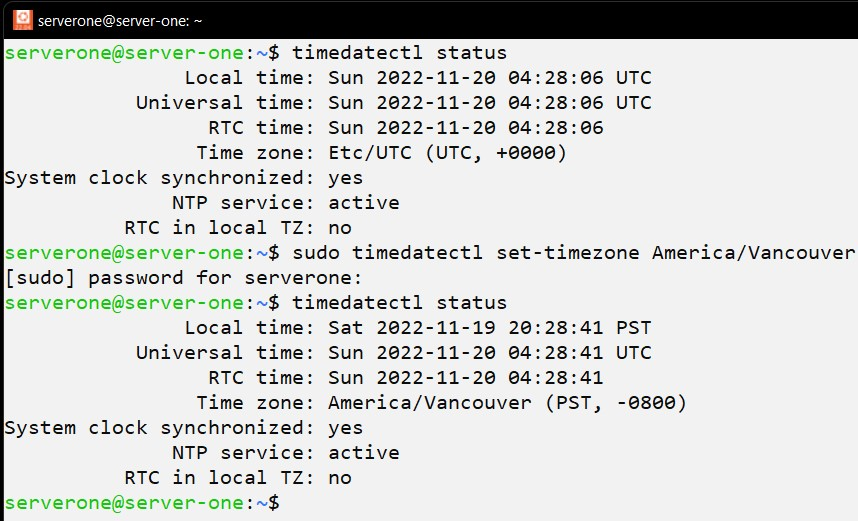

# ACIT 2420 - Week 11 Lab 

## Team Members: 
* **Amanda Chang** A01294905 
* **Jose Bangate** 

## Backup 

### Created 2 new servers on DigitalOcean 
* server-one 
* backup-server 

#### Steps to Create a Remote Server (Example for server-one) 
1. In **wsl**, Use `ssh-keygen -t ed25519 -C "OPTIONAL_COMMENT"` to generate a public/private key pair. Save it to a new file in the .ssh folder. 

2. Add a new SSH key in **DigitalOcean**: Click **Settings** -> Click **Security** -> Click **Add SSH Key** -> Copy and paste the public key from the .pub file in the .ssh folder into **SSH key content** box -> input a SSH key name into **Name** box -> Click **Add SSH Key**  

3. Create a new remote server in **DigitalOcean**: Select an existing project OR Create a **New Project** -> Click **Create** -> Click **Droplets** 

4. Create a regular user: In **wsl**, `ssh -i ~/.ssh/KEYFILE_NAME root@DIGITALOCEAN_IP_ADDRESS` -> 

5. Log in as server-one user, repeat step 1 to 4 for backup-server. 
After a public/private key pair is created for the backup-server, use `cat [KEY_FILE_NAME.pub] >> authorized_keys` to append the public key to authorized_keys file in **.ssh**.

### Development Environment (wsl) - Write Scripts and Unit Files 
* backup-script 
* backup.conf 
* backup-service.service *** Have location of where your backup-script will be located 
* backup-timer.timer 

### backup.conf 
The *backup.conf* configuration file includes two variables: 
- a directory to be backup 
- an IP address of the backup-server 

**Example**

<!--  -->

#### backup-script 
The *backup-script* source the *backup.conf* configuration file and use `rsync` command to backup a specified directory from server-one to the backup-server on every Friday at 01:00. 

**Example**

#### Unit File: backup-service.service 
The *backup-service.service* unit file executes the *backup-script* to backup files from server-one to the backup-server.  

**Example**

#### Unit File: backup-timer.timer 
The *backup-timer.timer* unit file sets backup service to start on every Friday at 01:00. 

**Example**

### Use `sftp` to Transfer Files to Remote Server 
1. In **wsl**, run `sftp -i .ssh/KEY_FILE_NAME USER_NAME@DIGITALOCEAN_IP_ADDRESS` command. 
2. Use `put -r FOLDER_NAME` to transfer all the files in a directory or `put FILE_NAME` to transfer a file. 

**Example**

### Switch to Ubuntu (Servers)
* Log in server-one by `ssh -i ~/.ssh/KEY_FILE_NAME USER_NAME@DIGITALOCEAN_IP_ADDRESS`.

### Set the Time Zone in Ubuntu 
* `timedatectl status` displays the current time zone 
* `timedatectl list-timezones` displays a list of available time zones 
* `sudo timedatectl set-timezone America/Vancouver` sets the time zone to America/Vancouver 

**Example**

### Locations to Store Script and Unit Files 

#### Script 
1. Create a new directory in **/opt** by `sudo mkdir /opt/NEW_DIR`.
2. Save the *backup-script* to the **/opt/NEW_DIR** by `sudo mv backup-script /opt/NEW_DIR`.
3. Depends on where you specified your backup.conf will be in *backup-script*, `sudo mv backup.conf [Specified Location]`. 

**Example**

#### Unit Files 
1. Save *backup-service.service* and *backup-timer.timer* unit files to **/etc/systemd/system/** 

**Example**

### Use `systemctl` to Manage Unit Files 

#### Service File 
1. `sudo systemctl enable SERVICE_FILE_NAME.service`
2. `sudo systemctl start SERVICE_FILE_NAME.service`
3. `sudo systemctl status SERVICE_FILE_NAME.service`

**Example**

#### Timer File 
1. `sudo systemctl enable TIMER_FILE_NAME.timer`
2. `sudo systemctl start TIMER_FILE_NAME.timer`
3. `sudo systemctl status TIMER_FILE_NAME.timer`
